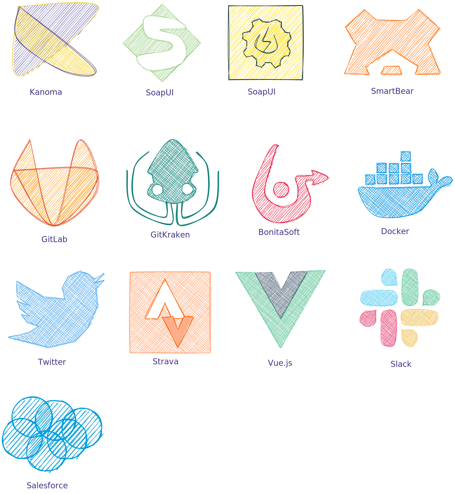
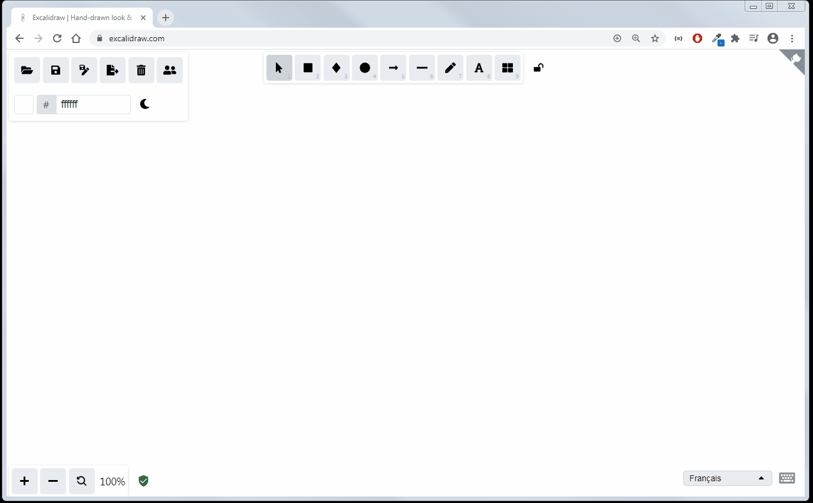

# Welcome to excalidrawLib

I wanted to use Excalidraw for other stuff than just playing and drawing random shapes.
So here is a first contribution (I will use these for later blog articles, stay tuned ^^)

## :thinking: How to use these icons ?
In a new Excalidraw window : 
- Click on "9 Library"
- Click on the Folder icon
- Select the "excalidrawLib\assets\importAsLib\logosAsLib.excalidrawlib" file from this project
- Start using the icons !! Et voila :)

