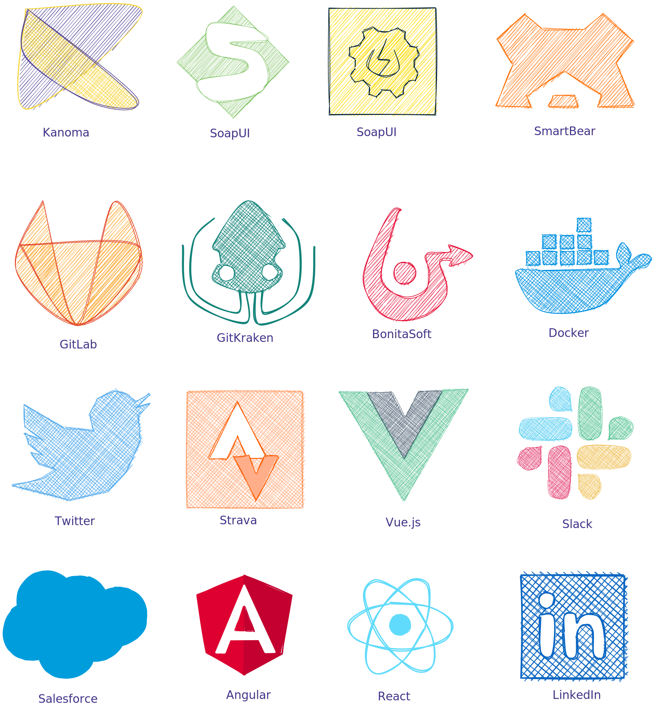

# excalidrawLib
I wanted to use Excalidraw for other stuff than just playing and drawing random shapes.
So here is a first contribution (I will use these for later blog articles, stay tuned ^^)

Added single SVGs.

BonitaSoft's logo :
- Red #e51138

Docker's logo :
- Blue #0091e2

GitLab's logo :
- Dark orange #e24329
- Orange	#fca326

GitKraken's logo :
- Blue 		#128379

Kanoma's logo :
- Yellow	#f6d330
- Blue 		#43338e

Salesforce's previous logo : 
- Blue	 	#009ddc

Slack's logo :
- Blue		#36c5f0
- Green		#2eb67d
- Yellow	#ecb22e
- Red		#e01e5a

SmartBear's logo :
- Orange	#ff730b

SoapUI's previous logo : 
- Green 	#67b845

SoapUI's new logo : 
- Yellow 	#fcdb00
- Grey 		#05263a

Strava's logo : 
- Orange 	#fcdb00

Twitter's logo :
- Blue 		#55acee

Vue's logo :
- Grey 		#31475e
- Green 	#3fb984

